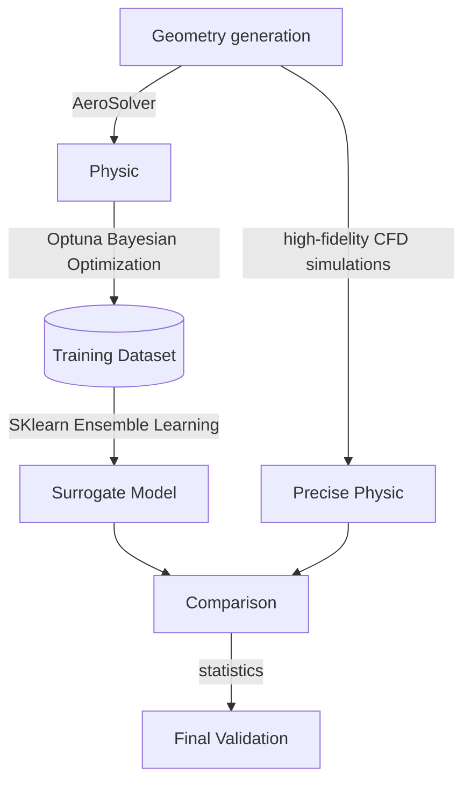

# AI-Driven Airfoil Optimization & Prediction Engine ✈️

This project implements a high-performance pipeline for aerodynamic shape optimization. The primary objective is to train a machine learning model capable of generating optimized airfoil geometries tailored to specific atmospheric and flight conditions.

---

## 🚀 Key Features
* **Flexible Geometry Generation:** Supports both NACA 4-digit configurations and Bézier Curves to define complex aerodynamic profiles.
* **Physics-Backed Simulations:** Integrated with `XFoil`/`AeroSandbox` for high-fidelity aerodynamic polar generation and boundary layer analysis.
* **Bayesian Optimization:** Utilizes `Optuna` to efficiently explore the design space and generate a robust dataset of airfoils optimized for maximum lift-to-drag ($L/D$) ratios.
* **Ensemble Learning:** Replaces computationally expensive iterative solvers with a **Random Forest Surrogate Model** built via `Scikit-Learn` for near-instantaneous inference.
* **Rigorous Validation:** Includes a statistical comparison between AI predictions and high-fidelity CFD simulations to ensure architectural reliability.

---

## 📂 Project Structure

```
Foil-Optimization-AI/
│
├── data/ # CSV datasets to train the AI
│ └── airfoil_optimization_results.csv
│
├── models/ # Serialized .pkl models.
│ └── airfoil_model.plk
│
├── notebooks/ # Exploratory data analysis and plotting.
│ ├── 01_airfoil_generation.ipynb
│ └── 02_dataset_generate.ipynb
│
├── src/ # Core logic (Geometry, Solver, Predictor).
│ ├── __init__.py
│ ├── airfoil_predictor.py
│ ├── geometry.py
│ └── physics.py
│
├── tests/ # Intermediate test.
│ ├── 01_test_NACA4412.ipynb
│ ├── 02_test_Opt.ipynb
│ └── 03_test_AI.ipynb
│
├── LICENSE
│
├── README.md
│
└── requirements.txt : Python dependencies.

```

---

## 🏗️ Workflow

The project follows a modular "Generator-Optimizer-Predictor" workflow:



---

## 📦 Installation

1. Clone the repository:

```Bash
git clone https://github.com/AntoineBert/Foil-Optimization-AI.git
```

2. Enter the project folder

```Bash
cd airfoil-ai-opt
```

3. Set up a virtual environment:

```Bash
python -m venv .venv
```
On Windows:
```Bash
.venv/bin/activate
```
On Mac/Linux:
```Bash
source .venv\Scripts\activate
```

Install dependencies:

```Bash
pip install -r requirements.txt
```

---

## 🛠️ Usage


1. Run 02_dataset_generate.ipynb
Generate the dataset by running the Optuna study. This will explore the design space and save results to data/.

```Python
python 02_dataset_generate.ipynb
```

2. Train the AI
Process the generated data and "freeze" the model.

```Python
from src.airfoil_predictor import AirfoilAI
ai = AirfoilAI("data/optimization_results.csv")
ai.save_model()
```

3. Predict & Visualize
Get the optimal NACA profile for any flight condition:

```Python
naca = ai.predict_naca(velocity=35, altitude=1500)
print(f"Optimal Profile: {naca}")
```

---

## 👥 Authors

Antoine BERTRAND - Main Developer

---

## 🏛 Academic Context

This project was developed in 2026 as part of the MECH580: AI and Engr Design curriculum at Colorado State University.

---

## ⚖️ License

Distributed under the MIT License. See LICENSE for more information.
